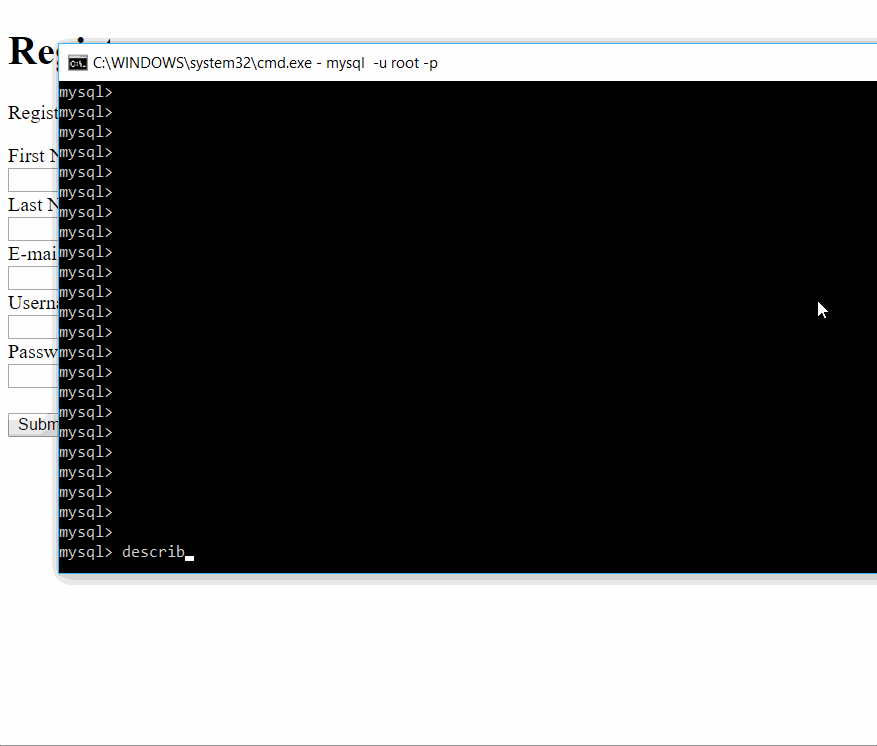

# Project 1 - Globitek CMS

Time spent: 7 hours spent in total

## User Stories

The following **required** functionality is completed:

1. [X]  Required: Create a Users Table
  * [X]  Required: Use the command line to connect to the database "globitek".
  * [X]  Required: Define a table "users" with the required columns.

2. [X]  Required: Create a Page with an HTML Form
  * [X]  Required: It has required text inputs.
  * [X]  Required: It submits to itself.
  * [X]  Required: It looks correct in a browser.
  
3. [X]  Required: Detect when the form is submitted.
  * [X]  Required: When page loads, page displays the form.
  * [X]  Required: When form submits, page retrieves the form data.

4. [X]  Required: Validate form data.
  * [X]  Required: Require the provided validation functions library.
  * [X]  Required: Validate the presence of all form values.
  * [X]  Required: Validate that no values are longer than 255 characters.
  * [X]  Required: Validate that first\_name and last\_name have at least 2 characters.
  * [X]  Required: Validate that username has at least 8 characters.
  * [X]  Required: Validate that email contains a "@".

5. [X]  Required: Display form errors if any validations fail.
  * [X]  Required: Do not submit the data to the database.
  * [X]  Required: Redisplay the form with the submitted values filled in.
  * [X]  Required: Report all errors as a list above the form.
  * [X]  Required: Test each field to ensure you get the expected errors.

6. [X]  Required: Submit successfully-validated form values to the database.
  * [X]  Required: Write an SQL insert statement.
  * [X]  Required: Add current date and time to "created\_at".
  * [X]  Required: Follow best practices regarding the query result and database connection.
  * [X]  Required: Use the command line to check the records.

7. [X]  Required: Redirect the user to a confirmation page.
    * [X]  Required: Locate the page "public/registration\_success.php".
    * [X]  Required: Redirect the user to the new page. ([Tips](#!hints))

8. [X]  Required: Sanitize all dynamic output for HTML. ([Tips](#!hints))

The following advanced user stories are optional:

* [ ]  Bonus 1: Validate that form values contain only whitelisted characters.

* [ ]  Bonus 2: Validate the uniqueness of the username.

## Video Walkthrough

Here's a walkthrough of implemented user stories:

GIF created with [LiceCap](http://www.cockos.com/licecap/).

## Notes

Describe any challenges encountered while building the app.

## License

    Copyright [yyyy] [name of copyright owner]

    Licensed under the Apache License, Version 2.0 (the "License");
    you may not use this file except in compliance with the License.
    You may obtain a copy of the License at

        http://www.apache.org/licenses/LICENSE-2.0

    Unless required by applicable law or agreed to in writing, software
    distributed under the License is distributed on an "AS IS" BASIS,
    WITHOUT WARRANTIES OR CONDITIONS OF ANY KIND, either express or implied.
    See the License for the specific language governing permissions and
    limitations under the License.